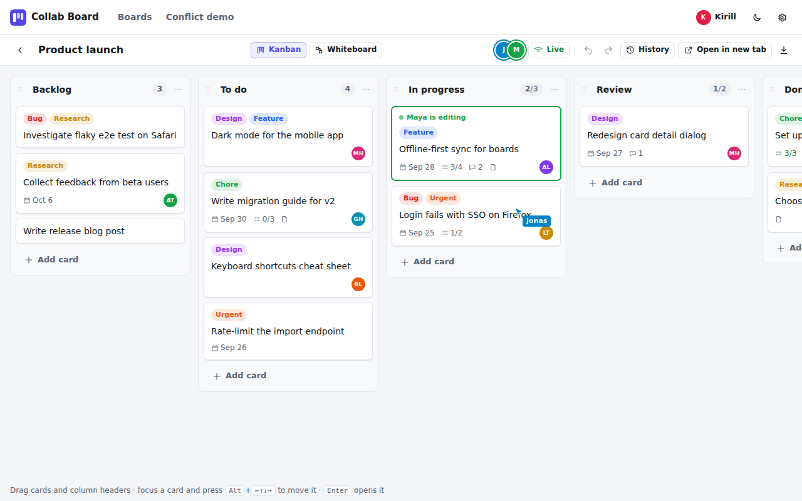
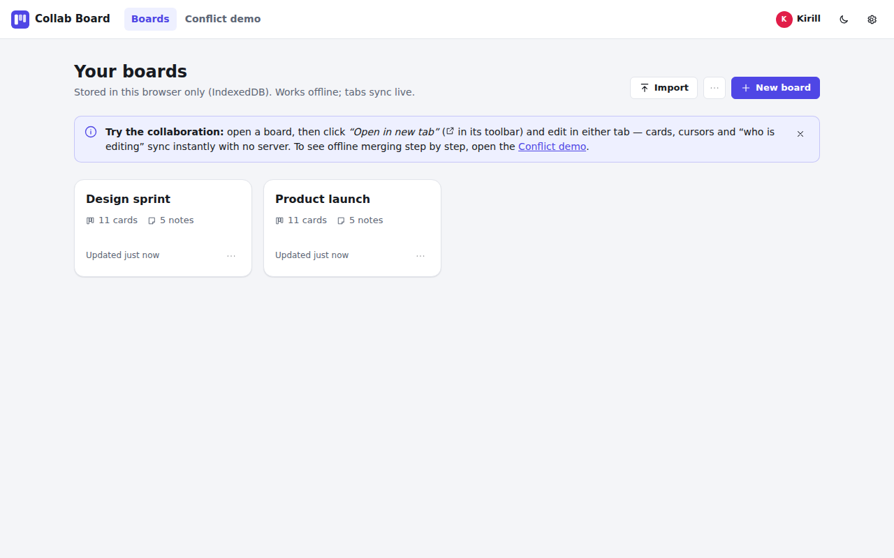
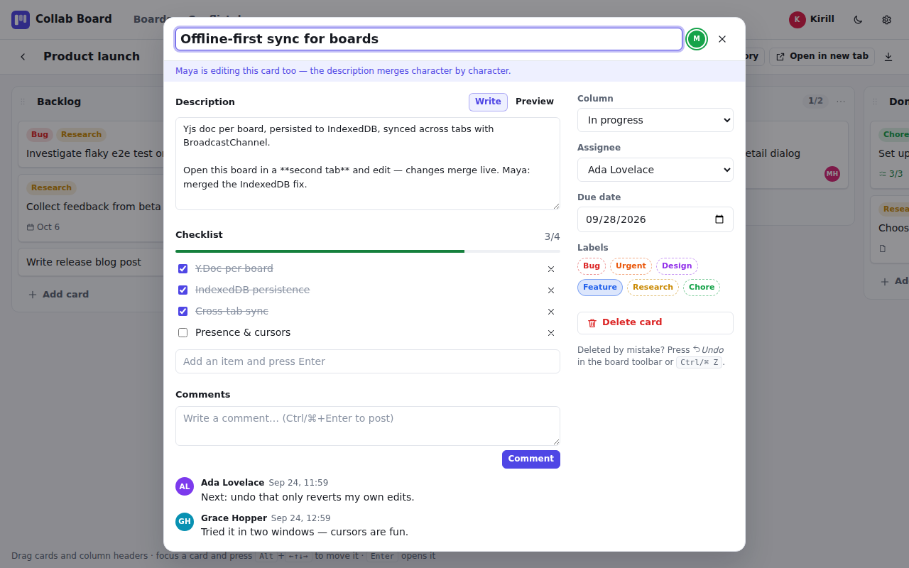
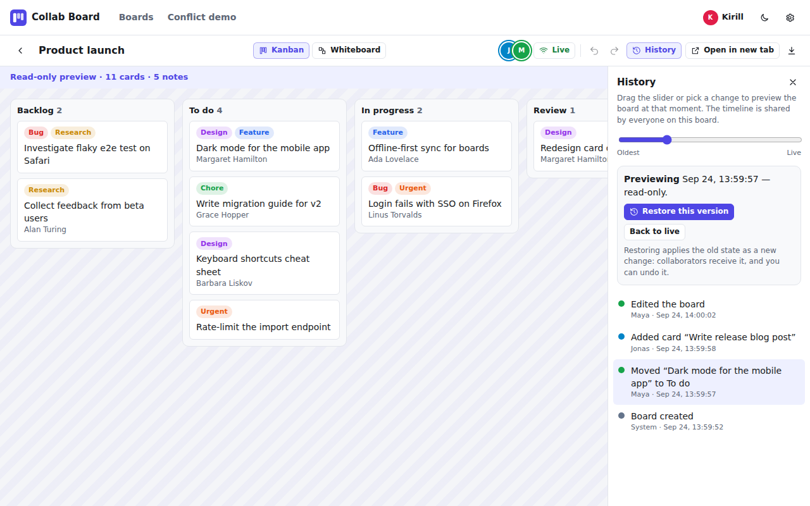
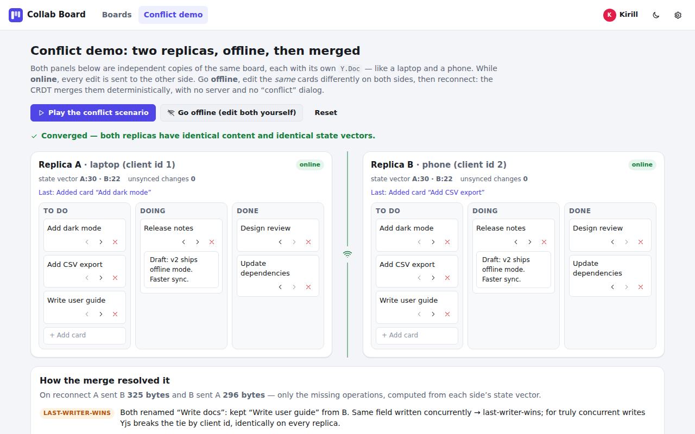
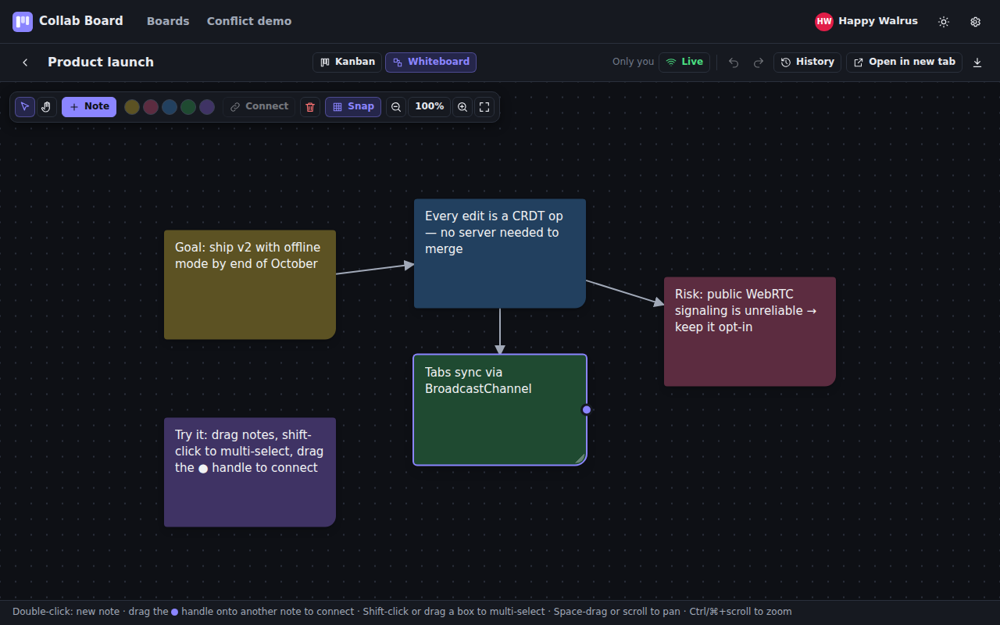
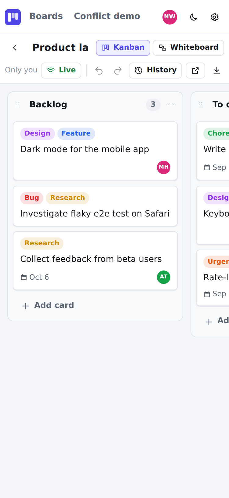
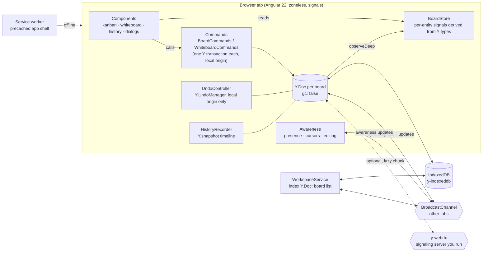

# Collab Board

**An offline-first collaborative kanban + whiteboard with no backend.** Open the same board in two tabs and edit in both: cards, cursors and "who is editing" sync instantly. Go offline, keep editing, reconnect, and the Yjs CRDT merges everything deterministically. Built with Angular 22 signals over Yjs, stored in IndexedDB, synced between tabs over BroadcastChannel.

**Live demo: https://usertrv.dev/projects/collab-board/** (a static host, served from a sub-path; loads and works offline after the first visit).



## Try it in 60 seconds

1. Open the demo. You get a seeded board, "Product launch".
2. Open the board, then click **Open in new tab** in its toolbar (on phones it is the ↗ icon). Move a card or type in a card's description in one tab and watch the other one.
3. Click **Live** to simulate going offline, edit in both tabs, then click **Reconnect**: both sides merge.
4. Open **History**, pick an older entry to preview the board at that moment, then restore it (restoring is itself undoable).
5. Open **Conflict demo**, press **Play the conflict scenario**, then **Reconnect & merge**. It shows step by step how concurrent renames, moves, deletes and text edits resolve.

## Screenshots

| | |
|---|---|
|  Boards list: create, rename, duplicate, import/export (JSON or raw Yjs update), delete |  Card dialog: Markdown description as `Y.Text` (merges character by character), checklist, comments, assignee, due date, labels. Another tab is editing the same card |
|  History: a shared timeline of Yjs snapshots, read-only preview, restore |  Conflict demo after the merge: identical content and state vectors, plus how each conflict was resolved |
|  Whiteboard (dark theme): sticky notes, connectors, marquee selection, pan/zoom, pinch on touch | <br>375 px phone layout |

## Features

- **Kanban:** columns with WIP limits; cards with labels, assignee, due date, checklist, comments and a Markdown description. Drag and drop (Angular CDK) for cards and columns, plus keyboard moves (`Alt`+arrows on a focused card, `Enter` opens it).
- **Whiteboard** in the same board document: sticky notes, arrows between notes, multi-select, snap to grid, pan/zoom, pinch on touch.
- **Real-time collaboration between tabs:** BroadcastChannel carrying the standard `y-protocols` sync and awareness messages. Presence avatars, live cursors and an "X is editing" marker on cards.
- **Offline first:** every board is its own `Y.Doc` persisted to IndexedDB. The **Live / Offline** toggle disconnects a tab so you can create conflicts on purpose. A service worker precaches the app shell, so after the first visit the app loads with no network at all (checked by reloading the board list, a board, the whiteboard and the conflict demo with the browser offline).
- **Per-user undo/redo:** `Ctrl/⌘+Z` or the toolbar buttons undo *your* last change, never a collaborator's, even if they edited after you.
- **History / time travel:** a shared timeline of Yjs snapshots with author and label. Preview any point read-only; restore it as a new, undoable change.
- **Conflict demo:** two in-page replicas you can take offline, edit on both sides and merge, with a report of what the CRDT did and how many bytes each side sent.
- **Import/export:** readable JSON, or the binary Yjs update (`.yjs`) that re-imports losslessly.
- **Optional cross-device P2P** via `y-webrtc` (off by default, lazy-loaded, needs your own signaling server; see Limitations).
- Light/dark theme, responsive down to 375 px, keyboard accessible. No accounts: each tab gets a random name and colour, changeable in Settings.

## Architecture



- `src/app/domain`: the data model on top of Yjs (schema, commands, fractional ranks, import/export, seed data). Plain TypeScript, unit tested without Angular.
- `src/app/core`: the Yjs ⇄ signals adapter (`y-signal.ts`), the `Y.Text` ⇄ `<textarea>` binding, BroadcastChannel sync, identity, theme.
- `src/app/data`: the per-board session (doc + persistence + sync + presence + undo + history), the workspace index, P2P.
- `src/app/features`: boards list, board shell, kanban, whiteboard, history, conflict demo, settings.

## Tech decisions and trade-offs

| Decision | Why | Cost |
|---|---|---|
| **Yjs** CRDT, no server | Deterministic merges, offline edits for free, small sync diffs (state vectors), mature ecosystem (IndexedDB, WebRTC, awareness) | Plain fields are last-writer-wins: concurrent edits of the same card title keep one value. Docs only grow (see History) |
| Entities in **`Y.Map`s keyed by id** + **fractional `rank`**, not `Y.Array` order | A move is one write of `columnId` + `rank`, so concurrent moves never duplicate or lose a card (delete + insert moves in a `Y.Array` do) | Rank strings grow slowly under repeated inserts at the same spot |
| **Per-entity signal projections** (a `card(id)` signal, a separate placement projection for ordering) | Editing one card re-renders one component; typing in a description never re-sorts a column. 1,000 cards stay responsive without virtual scroll | More adapter code than a single "board as JSON" signal |
| **BroadcastChannel** with standard `y-protocols` messages | Real multi-tab collaboration on a static host with zero infrastructure | Same browser only; cross-device needs P2P |
| **`y-webrtc` opt-in**, lazy chunk | Public signaling servers are unreliable; the core app must never depend on them | Needs a self-hosted signaling server; not verified end to end (see Limitations) |
| **`gc: false`** + `Y.snapshot` history | A snapshot is a state vector + delete set (a few hundred bytes); previews are rebuilt with `Y.createDocFromSnapshot` | Deleted content stays in the doc forever |
| **Per-user undo**: `Y.UndoManager` tracks only this tab's origin | Undo must never revert a collaborator's work | The undo stack is in memory, so it is gone after a reload |
| **Hand-written service worker** (about 30 lines) instead of `@angular/service-worker` | Every URL is relative to the worker, so it works from any sub-path. Network-first for the HTML shell, cache-first for hashed assets. `scripts/generate-sw.mjs` writes the precache list and version after `ng build` and fails the build if it cannot | No "new version available" prompt: a deploy is picked up on the next load once all old tabs are closed |
| **Hash routing + `baseHref: "./"`** | `dist/` works unchanged from any sub-path of a static host, with no rewrite rules | `#` in URLs |
| **No CDK virtual scroll** | It does not combine with cross-list CDK drag and drop; `content-visibility: auto` + per-card signals are enough for 1,000 cards | Boards with 10,000+ cards would need virtualization |

## Measured numbers

1,000-card stress board (*More → Create 1,000-card stress board*), production build.

| Metric | Apple M4, Chrome 153 headless, 1× CPU | Apple M4, 4× CPU throttle | Linux cloud container (4 vCPU), headless Chromium 141, 1× | Same container, 4× CPU throttle |
|---|---|---|---|---|
| Menu click → 1,000 cards rendered | 160 ms | 510 ms | 643–728 ms | 2,812 ms |
| Reload → 1,000 cards rendered from IndexedDB | 149 ms | 422 ms | 567–611 ms | 2,108 ms |
| 40 keyboard card moves: slowest keydown → next paint (Event Timing API) | 32 ms | 40 ms | 56–80 ms | 232 ms |
| Long animation frames > 50 ms during those moves | 0 | 0 | 1 | 50 |
| Cross-tab propagation (tab A move → tab B DOM updated), median / p90 | 3 / 18 ms | not measured | 10–12 / 20–21 ms | 49 / 69 ms |

- Bundle: **491 kB raw / ~137 kB transferred** initial JS + CSS. `y-webrtc` is a separate lazy chunk (109 kB raw / 30 kB transferred) that loads only when P2P is enabled.
- The container columns come from `scripts/perf.mjs` (ranges over three runs at 1×, a single run at 4×). The M4 columns were measured earlier with a scratch version of the same procedure; that session also dragged a card across 200-card columns with zero long animation frames. The shared cloud container is several times slower than a laptop, so read its columns as a floor, not as typical experience.

Reproduce with `pnpm build && pnpm perf` (`CPU=4 pnpm perf` for the throttled run; set `CHROME_PATH` to a local Chromium or Chrome binary).

## Run, test, build

Requires Node >= 24.15 and pnpm 9.15.4 (`corepack enable`).

```bash
pnpm install
pnpm start        # dev server at http://localhost:4200 (service worker is disabled in dev mode)
pnpm lint         # angular-eslint
pnpm test         # 61 unit and component tests (Vitest + jsdom + fake-indexeddb)
pnpm build        # static site in dist/ (index.html at the root) + service worker precache list
pnpm perf         # optional, after a build: the numbers above (needs a local Chromium)
```

`dist/` is fully static and path-independent: copy it into any directory of any static host (for example `/projects/collab-board/`). The `CI` workflow runs install, lint, test and build on every push and pull request.

The tests cover the places where bugs would be silent: convergence of concurrent edits across replicas (moves, delete vs. edit, text), fractional ranks, per-user undo, history snapshots and restore, import/export round trips, BroadcastChannel sync, the Yjs ⇄ signals adapter and the conflict demo's merge report.

## Limitations

- **Cross-device P2P (`y-webrtc`) did not connect in testing.** Against a local `y-webrtc-signaling` server both devices reached the signaling server and discovered each other, but in the headless test environment the WebRTC data channel never opened (`ERR_CONNECTION_FAILURE`), so no data synced over P2P. The toolbar chip counts only *open* data channels, so it honestly shows "0 peers" in that case. Tab-to-tab sync over BroadcastChannel is the verified path. While the configured signaling server is unreachable, y-webrtc keeps retrying and the browser logs a `WebSocket connection ... failed` console error per attempt; with P2P off (the default) the app makes no network requests beyond loading its own files.
- **Docs only grow.** History needs `gc: false`, so deleted content stays inside the board doc. The timeline is capped at 150 entries, but the doc itself is never compacted.
- **Sticky-note text is a plain last-writer-wins string**, not `Y.Text`: when two people edit the same note at the same time, one version wins. Card descriptions are `Y.Text` and merge.
- **The board title lives in the workspace index doc**, so renaming a board is not undoable; `meta.title` inside the board doc is only a copy for exports.
- **Identity is per tab** (sessionStorage). The browser's "Duplicate tab" copies it, so two tabs can show the same name; the in-app **Open in new tab** button gets a fresh one.
- **Remote cursors on the kanban use content-pixel coordinates**, so they are only approximate between windows of different widths.
- **Data never leaves the browser** unless you export it or enable P2P: clearing site data deletes every board. Deleting a board cannot be undone (the confirmation says so).
- **No virtual scrolling**: fine for 1,000 cards (see the numbers), not designed for 10,000+.

## License

[MIT](LICENSE) © Kirill Levin
